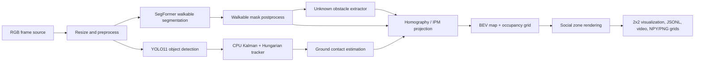

# RGB Social Navigation BEV

CPU-only monocular RGB perception pipeline for social navigation visualization. It estimates walkable area, people, known obstacles, low-confidence RGB-estimated unknown obstacles, person tracks, social safety zones, and a bird's-eye-view occupancy grid.

This project does not use depth images, LiDAR, ROS as a runtime dependency, GPU execution, or CUDA-specific code. It is a perception and risk-visualization tool only; it is not a safety-certified system and must not be used as a direct robot safety controller.

## Architecture



## Install

Ubuntu 22.04 with Python 3.10 or newer is supported.

```bash
python -m pip install -r requirements.txt
python -m pip install -r requirements-dev.txt
```

If you want a strict CPU PyTorch wheel, install PyTorch from the official CPU index before installing this project, then run the requirements command again.

## CPU-Only Notes

- Runtime device is forced to `cpu`.
- YOLO inference passes `device="cpu"`.
- `runtime.cpu_threads` or `SOCIAL_BEV_CPU_THREADS` controls OpenCV/PyTorch CPU threads.
- Segmentation and detection intervals can be raised for speed:

```yaml
runtime:
  segmentation_interval: 4
  detection_interval: 3
```

## SCAND Sample

The downloader uses Hugging Face Datasets streaming and does not download the full dataset.

```bash
python scripts/download_scand_sample.py \
  --output data/scand_sample \
  --split validation \
  --max-frames 2000 \
  --stride 10
```

It writes `data/scand_sample/images/frame_000001.jpg` and `data/scand_sample/manifest.jsonl`. Re-running the same command resumes from existing manifest records. If Hugging Face is unavailable, place a local video at `data/input.mp4` or run `tools/make_demo_video.py`.

## Models

Default segmentation model:

```text
nvidia/segformer-b0-finetuned-ade-512-512
```

Default detector:

```text
YOLO11n
```

Export OpenVINO models:

```bash
python scripts/export_yolo_openvino.py --model yolo11n.pt --imgsz 416
python scripts/export_segmentation_openvino.py \
  --model nvidia/segformer-b0-finetuned-ade-512-512 \
  --output models/segformer_b0_ade_openvino
```

If OpenVINO models are missing or export fails, the runtime falls back to Torch/Ultralytics CPU where possible. Segmentation can use a clearly marked RGB heuristic fallback when model loading fails, controlled by `segmentation.allow_classical_fallback`.

## Calibration

For metric BEV, calibrate a ground-plane homography:

```bash
python tools/calibrate_ipm.py \
  --input data/calibration_frame.jpg \
  --output configs/calibration.yaml
```

Click in this order: `far-left`, `far-right`, `near-right`, `near-left`. Press `r` to reset and `s` to save. Without a calibration file, the pipeline uses a manual trapezoid and clearly displays `NON-METRIC BEV` and `NORMALIZED SOCIAL ZONE`.

## CLI

Video:

```bash
python -m social_bev.run \
  --input data/input.mp4 \
  --config configs/default.yaml \
  --calibration configs/calibration.yaml \
  --output outputs/result.mp4 \
  --device cpu
```

SCAND/image directory:

```bash
python -m social_bev.run \
  --input data/scand_sample/images \
  --output outputs/scand_demo.mp4
```

Webcam:

```bash
python -m social_bev.run \
  --input 0 \
  --output outputs/webcam_record.mp4
```

The output FPS matches the input video when available. Otherwise it defaults to 20 FPS.

## GUI

The default local GUI uses Tkinter and does not require Streamlit:

```bash
python gui.py
```

Use the GUI to select a real local video, image directory, webcam index typed as `0`, or `data/scand_sample/images` after downloading SCAND frames. It processes frames incrementally and writes video, JSONL, and occupancy outputs.

Optional Streamlit web UI:

```bash
streamlit run app.py
```

The Streamlit UI supports uploaded video, local video path, SCAND sample path, calibration YAML, detection confidence, walkable classes, social zone radii, frame stride, progress, four-panel preview, output video, JSONL, and CPU FPS statistics. Video is processed frame by frame.

## Outputs

- `outputs/result.mp4`: 2x2 visualization.
- `outputs/results.jsonl`: one JSON object per processed frame.
- `outputs/occupancy/frame_000001.npy`: exact occupancy values.
- `outputs/occupancy/frame_000001.png`: grayscale preview; unknown `-1` is shown as 127.
- `outputs/benchmark.json`: CPU benchmark summary.

Occupancy values:

```text
-1  unknown
0   free
50  social caution
80  unknown obstacle
100 occupied
```

## Benchmark

```bash
python scripts/benchmark_cpu.py --input data/input.mp4 --frames 200
```

The benchmark reports average FPS, median latency, P95 latency, segmentation latency, detection latency, tracking latency, and BEV latency.

## ROS2 Adapter

The optional adapter is in `ros2/social_bev_node.py`. It only runs when ROS2 Humble, `rclpy`, standard messages, and `cv_bridge` are already installed. The core package has no ROS2 dependency.

## Tests

```bash
pytest -q
```

The tests cover homography, invalid matrix detection, ground contact estimation, tracker ID continuity, short missed detections, empty detections, walkable class merge, unknown obstacle filtering, BEV occupancy values, image directory source, video source, and non-metric calibration fallback.

## Troubleshooting

- Hugging Face download fails: use `tools/make_demo_video.py` or place a local video at `data/input.mp4`.
- OpenVINO export fails: keep `segmentation.backend: torch` or use YOLO fallback model.
- YOLO model missing: keep network enabled for Ultralytics model download, or place `yolo11n.pt` in the project root.
- No GUI display: CLI automatically disables OpenCV display unless `--display` is requested and a display is available.
- Slow CPU FPS: increase model intervals, reduce `runtime.input_width/input_height`, increase frame stride, use OpenVINO exports, and set CPU thread count.

## RGB Limitations

- Monocular RGB does not provide true depth.
- Homography assumes a flat ground plane.
- Camera height, pitch, or mounting changes require recalibration.
- Hanging obstacles may project incorrectly.
- Occluded person feet can make BEV position inaccurate.
- Unknown obstacles are low-confidence RGB estimates, not measured 3D obstacles.
- This project is not safety-certified and must not directly control robot safety behavior.

## Acceptance Commands

```bash
python -m pip install -r requirements.txt
pytest -q
python scripts/download_scand_sample.py --max-frames 100 --stride 20
python -m social_bev.run \
  --input data/scand_sample/images \
  --output outputs/scand_demo.mp4
```
