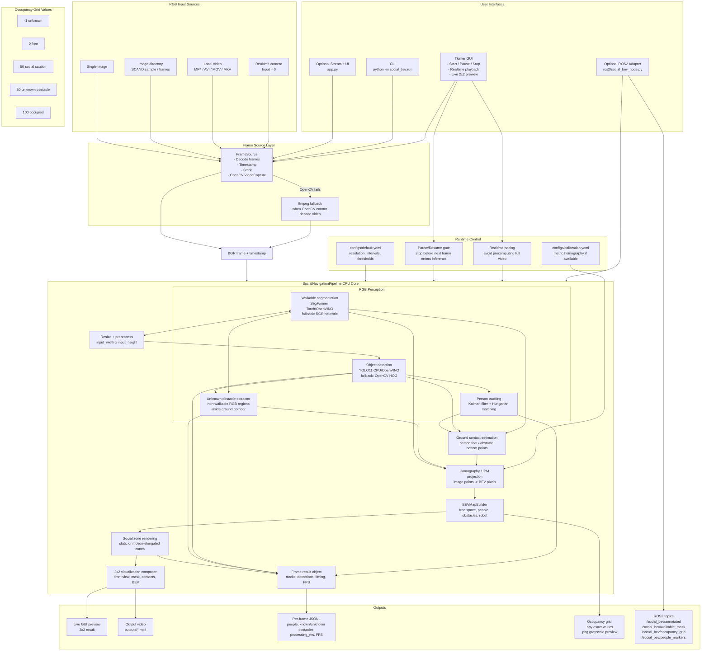

# RGB Social Navigation BEV System Architecture

## System Architecture

## Notes

- The system is online frame-by-frame processing. It does not need to precompute the full video.
- GUI pause stops the next frame before it enters the inference pipeline; it cannot interrupt the currently running inference call.
- Realtime camera input is supported by setting the input to `0`, but CPU inference speed is not guaranteed to match the camera FPS.
- Without `configs/calibration.yaml`, BEV is non-metric and displayed as `NON-METRIC BEV`.
- This project is for perception and risk visualization, not a safety-certified robot controller.
